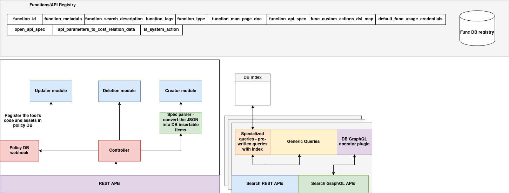

# Functions Registry

## Introduction

The **Functions Registry** provides a centralized API-driven interface for registering, storing, updating, and querying computational function entries. Each function encapsulates metadata, API specifications, protocol types, and organization-scoped governance fields.

This system acts as the source of truth for all available functions across environments, enabling agents, tools, or orchestration layers to:

* **Register new functions** with metadata, search descriptions, OpenAPI specs, and usage constraints
* **Query existing functions** by ID, tags, type, or custom filters
* **Update or delete registered functions** through RESTful endpoints
* **Upload and register function bundles** via structured ZIP packages

Functions can be registered with information such as:

* Protocol type (HTTP, WebSocket, etc.)
* API input/output spec
* Execution constraints (e.g., cost model, credential config)
* Documentation and man pages
* Organizational mapping metadata

The registry operates using a MongoDB-backed store and exposes a set of REST APIs to facilitate direct integration with agent frameworks, DSL selectors, and external applications.


---

## Functions DB Registry Architecture

The **Functions DB Registry** is the canonical backend service for storing, indexing, and managing function definitions, execution metadata, and usage constraints. It provides a centralized database of organizational functions with rich metadata and standardized input/output schemas. The registry supports function discovery, DSL-driven selection, and access via REST and GraphQL APIs. It is optimized for modular ingestion, policy-aware CRUD workflows, and query extensibility.



---

### Data Model and Storage Layer

At its core, the Functions DB Registry organizes function metadata into a unified structured collection:

* **`function_entry`**: This logical record captures all relevant metadata for a function. Key fields include:

  * **Identification and Description**: `function_id`, `function_search_description`, `function_type`, `function_tags`
  * **Specifications and Protocols**: `function_api_spec`, `open_api_spec`, `function_man_page_doc`
  * **Governance and DSL Hooks**: `func_custom_actions_dsl_map`, `is_system_action`, `default_func_usage_credentials`
  * **Execution Estimation**: `api_parameters_to_cost_relation_data` (for cost/time estimation or planning)

Each entry is stored in a MongoDB collection (`functions`) with queryable indexes applied on `function_id`, `function_tags`, `function_type`, and `is_system_action` to support performant search across common access patterns.

---

### Function Registration Pipeline

The Functions DB Registry follows a modular CRUD architecture for managing the function lifecycle. Each operation is encapsulated in a specific module that performs validation, transformation, and database interaction.

#### **Creator Module**

* Accepts a ZIP-based function bundle (`spec.json`, `function.md`, `function.zip`)
* Uses the **Spec Parser** to normalize and extract metadata from JSON
* Uploads binary assets to object storage (e.g., S3) and stores references in `function_source_code_link`
* Inserts a complete function entry into the registry DB
* Supports webhook notifications for registering the function code in the **Policy DB**

#### **Updater Module**

* Supports targeted updates to specific fields (e.g., `function_tags`, `open_api_spec`)
* Performs schema validation and backward compatibility checks
* Can trigger re-evaluation in downstream execution layers or contract systems if certain fields (e.g., `api_spec`) are modified

#### **Deletion Module**

* Handles safe deletion of function records
* Ensures dependency and policy checks are passed before removal
* Notifies external systems to remove associated code or runtime bindings

#### **Controller**

* Serves as the gateway to all CRUD operations
* Exposes REST APIs for direct invocation
* Invokes specialized modules as needed and propagates webhook triggers
* Acts as a central coordinator for auditing, monitoring, and external integrations (e.g., **Policy DB**)

---

### Query Engine and Indexing

To support fast, dynamic lookup of function records, the registry uses an indexed document model with pluggable access interfaces:

* **Search REST APIs**: Predefined query endpoints (by type, tag, keyword, etc.) optimized via Mongo indexes
* **Search GraphQL API**: Supports flexible, client-driven queries with filter logic passed as `GenericScalar` objects
* **DB GraphQL Operator Plugin**: Converts GraphQL `query:` fields into MongoDB-compatible filter expressions at runtime
* **Index Layer**: Maintains secondary indexes on high-cardinality fields like `function_tags`, `function_type`, and `function_search_description`

---

## Schema

The Functions Registry maintains structured records for each function using a primary schema called `FunctionEntry`. This schema is used for storing and querying individual function definitions, and it is extended with contextual metadata for organizational governance and DSL-driven workflows.

Below are the core data structures maintained by the Functions Registry:

---

### `FunctionEntry`

Represents the canonical definition of a computational function.

```python
@dataclass
class FunctionEntry:
    function_id: str
    function_metadata: Dict[str, Any]
    function_search_description: str
    function_tags: List[str]
    function_type: str
    function_man_page_doc: str
    function_api_spec: Dict[str, Any]
    func_custom_actions_dsl_map: Dict[str, Any]
    default_func_usage_credentials: Dict[str, Any]
    open_api_spec: Dict[str, Any]
    api_parameters_to_cost_relation_data: Dict[str, Any]
    is_system_action: bool
```

| Field                                  | Type        | Description                                                          |
| -------------------------------------- | ----------- | -------------------------------------------------------------------- |
| `function_id`                          | `str`       | Unique identifier for the function                                   |
| `function_metadata`                    | `dict`      | Arbitrary metadata related to the function (e.g., labels, versions)  |
| `function_search_description`          | `str`       | Search-optimized textual summary of the function                     |
| `function_tags`                        | `List[str]` | List of tags used for filtering, categorization                      |
| `function_type`                        | `str`       | Type/category of function (e.g., "model", "utility", etc.)           |
| `function_man_page_doc`                | `str`       | Human-readable documentation (Markdown)                              |
| `function_api_spec`                    | `dict`      | Input/output spec with types and constraints                         |
| `func_custom_actions_dsl_map`          | `dict`      | DSL logic for custom behavior integration                            |
| `default_func_usage_credentials`       | `dict`      | Optional default access credentials (for private functions)          |
| `open_api_spec`                        | `dict`      | OpenAPI v3-compatible specification for documentation and validation |
| `api_parameters_to_cost_relation_data` | `dict`      | DSL or lookup table to estimate cost/resource consumption            |
| `is_system_action`                     | `bool`      | Marks the function as system-provided (non-user-defined)             |

---

### Extended Usage

The raw `FunctionEntry` is used by the following systems:

* **REST APIs** to register/query/update functions
* **Execution engines** to validate and execute based on `function_api_spec`
* **DSL selectors** to match functions using `function_metadata`, `function_tags`, and `function_search_description`

---

## REST API Endpoints

The Functions Registry exposes a set of RESTful endpoints for managing function entries. These APIs allow external systems to upload, retrieve, update, delete, and query registered functions.

All endpoints follow the base path:

```
/functions
```

### 1. Upload Function Bundle

**`POST /functions/upload`**

Registers a new function by uploading a ZIP bundle that includes `spec.json`, `function.md`, and `function.zip`.

#### Request (multipart/form-data)

| Part   | Description                                                        |
| ------ | ------------------------------------------------------------------ |
| `file` | ZIP file containing `spec.json`, `function.md`, and `function.zip` |

#### Response (200 OK)

```json
{
  "message": "Function uploaded successfully",
  "function_id": "function_xyz"
}
```

---

### 2. Get Function by ID

**`GET /functions/<function_id>`**

Retrieves the complete metadata of a function.

#### Response (200 OK)

```json
{
  "function_id": "function_xyz",
  "function_metadata": { ... },
  ...
}
```

---

### 3. Update Function

**`PUT /functions/<function_id>`**

Updates one or more fields in an existing function entry.

#### Request (JSON)

```json
{
  "function_metadata": { "owner": "teamX" },
  "function_tags": ["tag1", "tag2"]
}
```

#### Response (200 OK)

```json
{ "message": "Function updated successfully" }
```

---

### 4. Delete Function

**`DELETE /functions/<function_id>`**

Deletes a function from the registry.

#### Response (200 OK)

```json
{ "message": "Function deleted successfully" }
```

---

### 5. Query by Type

**`GET /functions/query/by-type?type=<type>`**

Returns a list of functions matching a given `function_type`.

#### Response (200 OK)

```json
[ { "function_id": "f1", ... }, { "function_id": "f2", ... } ]
```

---

### 6. Query by Tag

**`GET /functions/query/by-tag?tag=<tag>`**

Fetches all functions that contain the given tag.

---

### 7. Query by Keyword

**`GET /functions/query/by-keyword?keyword=<text>`**

Performs a case-insensitive search across `function_search_description`.

---

### 8. Query by System Flag

**`GET /functions/query/by-system-flag?is_system=true`**

Returns only system-defined or user-defined functions.

---

### 9. Generic Mongo Query

**`POST /functions/query/generic`**

Accepts a full MongoDB-style filter to query arbitrary fields.

#### Request (JSON)

```json
{ "function_metadata.owner": "teamX", "function_type": "model" }
```

---

### 10. GraphQL Endpoint

**`POST /functions/graphql`**

Also available at `/functions/graphql` (with GraphiQL UI) to run complex queries using the GraphQL interface.

---

## GraphQL Endpoint

The Functions Registry provides a GraphQL endpoint to allow flexible and composable queries over registered functions. This is particularly useful for frontend systems, orchestration tools, or workflows that need filtered access to metadata without relying on rigid REST routes.

---

### Endpoint

**`POST /functions/graphql`**

GraphiQL UI is available at the same endpoint for interactive query testing.

---

### Schema

The primary object exposed is `FunctionEntryType` which maps to the internal `FunctionEntry` model.

```graphql
type FunctionEntryType {
  function_id: String
  function_metadata: GenericScalar
  function_search_description: String
  function_tags: [String]
  function_type: String
  function_man_page_doc: String
  function_api_spec: GenericScalar
  func_custom_actions_dsl_map: GenericScalar
  default_func_usage_credentials: GenericScalar
  open_api_spec: GenericScalar
  api_parameters_to_cost_relation_data: GenericScalar
  is_system_action: Boolean
}
```

> Note: `GenericScalar` allows arbitrary nested JSON.

---

### Root Query

```graphql
type Query {
  functions(query: GenericScalar!): [FunctionEntryType]
}
```

The `functions` field accepts a MongoDB-style query filter as a `GenericScalar` and returns a list of matching functions.

---

### Example Queries

#### List all functions of type "utility"

```graphql
query {
  functions(query: { function_type: "utility" }) {
    function_id
    function_tags
    function_metadata
  }
}
```

#### Find functions with a specific tag

```graphql
query {
  functions(query: { function_tags: "analytics" }) {
    function_id
    function_type
    function_search_description
  }
}
```

#### Get function API specs and cost model by ID

```graphql
query {
  functions(query: { function_id: "predict_abc_v2" }) {
    function_id
    function_api_spec
    api_parameters_to_cost_relation_data
  }
}
```

---

### Response Format

The GraphQL response conforms to standard GraphQL result shape:

```json
{
  "data": {
    "functions": [
      {
        "function_id": "predict_abc_v2",
        "function_type": "model",
        "function_tags": ["analytics", "forecast"]
      },
      ...
    ]
  }
}
```

---
