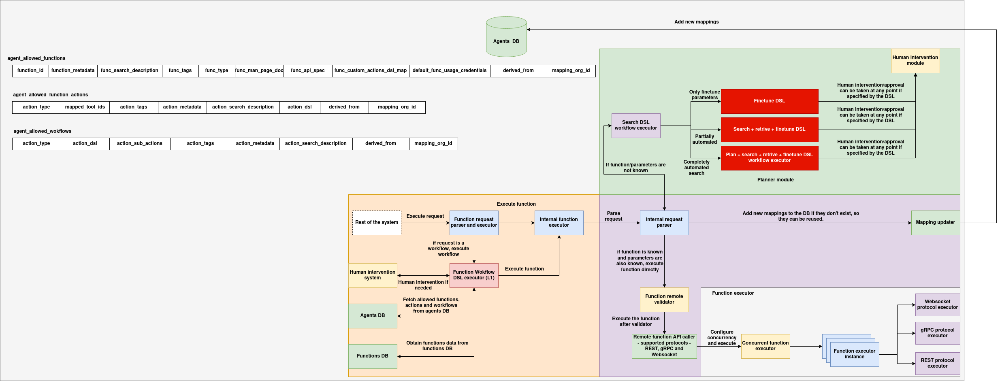

## Introduction

The **Functions Registry SDK** is a unified Python client that interacts with the MongoDB-backed Functions Registry service and supports both **function discovery** and **function execution**.

It serves as the official integration layer for internal agents, execution environments, and DSL pipelines that need to:

* Discover functions by ID, tags, type, or metadata
* Fetch full function specifications including API contracts and cost estimates
* Execute functions locally or via HTTP/WebSocket protocol backends
* Automatically download and register functions before execution
* Validate input data against declared API specs

The SDK integrates with `FunctionsExecutorManager` and dynamically resolves function execution based on its declared `function_protocol_type`.

---

## Functions SDK Architecture

The **Functions SDK** is a modular and extensible runtime layer that enables intelligent discovery, validation, and execution of computational functions. It acts as the interface between agent-level systems and the function registry infrastructure, supporting dynamic execution paths that span single-call functions, DSL-evaluated actions, and full DAG-based workflows.

It integrates with both **Agents DB** and **Functions DB**, supports input-driven DSL selectors, and allows protocol-level execution (REST, WebSocket, gRPC) with optional human intervention, validation, and concurrency controls.



---

### Agent Data Mappings

The execution flow relies on scoped mappings defined in the **Agents DB**, which includes:

* `agent_allowed_functions`: Allowed function entries with metadata, DSL hooks, and credentials
* `agent_allowed_function_actions`: Grouped functions under an action with DSL logic
* `agent_allowed_workflows`: DAG-style workflows composed of multiple action nodes

These mappings ensure that each agent or organization only accesses authorized components within their scope.

---

### Planner and Search DSL Executor

Before function execution begins, the SDK evaluates DSL-based selection plans:

* **Search DSL Workflow Executor**: Invoked when the request refers to an action or workflow.
* DSL modes include:

  * **Fine-tune only** (parameters known, function pool known)
  * **Search + fine-tune** (parameters unknown)
  * **Retrieve + search + DSL** (completely automated discovery)
* Human approval checkpoints can be defined in the DSL and are routed to the **Human Intervention Module**.

---

### Execution Flow (Controller + Validator)

The core execution path includes:

1. **Function Request Parser**
   Identifies whether the request is a raw function call, an action DSL, or a workflow DAG. Delegates accordingly.

2. **Internal Function Executor**
   Handles single function invocation. If the function is already registered and validated, it is directly executed.

3. **Function Remote Validator**
   Validates protocol compatibility, required credentials, and contract metadata before execution.

4. **Remote Protocol Executor**
   Depending on the function’s protocol type (`REST`, `WebSocket`, or `gRPC`), the execution is dispatched to the appropriate backend executor.

---

### Function Workflow Execution (L1 Orchestrator)

When the request is a **workflow**, the **Function Workflow DSL Executor** loads the workflow graph from the DB, topologically evaluates each action node using DSL, selects the corresponding function, and executes the entire graph step-by-step. Outputs from upstream functions are merged into inputs for downstream functions.

The DAG executor ensures:

* No cyclic dependency
* Context-aware input propagation
* Structured output per `function_id`

---

### Concurrency, Instance, and Mapping Handling

* **Function Executor Instance**
  Encapsulates each running function’s state and execution context.

* **Concurrent Function Executor**
  Supports isolated or parallel function invocations within the same session.

* **Mapping Updater**
  Adds new function/action/workflow mappings to the Agent DB if they were discovered dynamically during the request.

---

## Installation

The `functions_sdk` package provides programmatic access to the Functions Registry. It supports metadata fetching, DSL-based action and function selection, and runtime execution of registered functions.

### Prerequisites

* Python 3.7 or higher
* `pip` (Python package installer)

---

### Option 1: Local Installation from Source

```bash
cd functions_sdk/
pip install .
```

---

### Option 2: Editable Installation for Development

```bash
cd functions_sdk/
pip install -e .
```

---

### Option 3: Installation from Private Package Index

```bash
pip install functions_sdk --extra-index-url https://your-internal-pypi/
```

---

### Post-Installation Verification

```bash
python -c "from functions_sdk import FunctionsManager; print('FunctionsManager available')"
```

---

## Basic Usage

### 1. Initialize the `FunctionsManager`

```python
from functions_sdk import FunctionsManager

functions = FunctionsManager(
    functions_db_url="http://functions-db-service:5000",
    workflows_base_uri="http://workflow-registry:6000"
)
```

---

### 2. Register a Function from the DB

```python
functions.add_function(
    function_id="func-weather-001",
    derived_from="functions-db",
    mapping_org_id="org-xyz"
)
```

---

### 3. Create a Function Action

```python
functions.create_action(
    action_type="weather-action",
    function_ids=["func-weather-001", "func-weather-002"],
    action_tags=["weather", "forecast"],
    action_metadata={"region": "global"},
    action_search_description="Aggregates weather forecast results",
    action_dsl={},
    derived_from="functions-db",
    mapping_org_id="org-xyz"
)
```

---

### 4. Execute a Function Directly by ID

```python
output = functions.execute_function_by_id(
    function_id="func-weather-001",
    input_data={"city": "Bangalore"}
)
print("Output:", output)
```

---

### 5. Execute a Function Selected via DSL Search

```python
output = functions.execute_by_function_search(
    workflow_id="select_weather_function",
    input_data={"city": "London"},
    search_parameters={"region": "EMEA"}
)
```

---

### 6. Execute a Function via Action + DSL-Based Function Selection

```python
output = functions.execute_by_action_search(
    workflow_id="select_best_weather_action",
    input_data={"lat": 12.97, "lon": 77.59},
    search_parameters={"precision": "high"}
)
```

---

### 7. Execute a Full Workflow DAG

```python
results = functions.execute_workflow_dag(
    workflow_id="weather_analysis_dag",
    mapping_org_id="org-xyz",
    user_input={"domain": "weather"},
    initial_payload={"location": "Berlin"}
)
```

---

## Advanced Features

### 1. On-Demand Function Registration

```python
output = functions.execute_function_by_id("func-auto-001", {"x": 10})
```

Automatically fetches the function metadata if not pre-loaded.

---

### 2. DSL-Based Selection

```python
output = functions.execute_by_function_search(
    workflow_id="select_geo_function",
    input_data={"lat": 10, "lon": 20},
    search_parameters={"category": "mapping"}
)
```

---

### 3. Input Validation

```python
functions.execute_function_by_id("func-validate", {"temperature": 42})
```

Validated against `function_api_spec` (type, bounds, shape, etc.)

---

### 4. Protocol-Aware Execution

Depending on `function_protocol_type`, execution is routed via:

* HTTP
* WebSocket

---

### 5. Action DSL Evaluation

```python
functions.execute_by_action_search(
    workflow_id="select_optimal_nlp",
    input_data={"text": "This is a sentence"},
    search_parameters={"quality": "high"}
)
```

---

## Class Reference

### `class FunctionsManager`

#### Constructor

```python
FunctionsManager(functions_db_url: str, workflows_base_uri: str)
```

---

### Methods

#### `add_function(...)`

Registers a function by fetching from the DB.

#### `create_action(...)`

Creates a grouped action with DSL for selection.

#### `search_function(...)`

Selects the best function using a DSL workflow.

#### `search_action(...)`

Selects the best action using DSL.

#### `search_function_from_action(...)`

Uses the DSL inside an action to select a function.

#### `execute_function_by_id(...)`

Executes a function directly.

#### `execute_by_function_search(...)`

DSL selection + execution.

#### `execute_by_action_search(...)`

DSL action + function selection + execution.

#### `execute_workflow_dag(...)`

Executes a DAG-based function workflow using `workflow_to_functions_graph`.

---

## Supporting Classes

### `FunctionsRegistryDB`

Fetches function metadata from persistent DB.

---

### `FunctionsExecutorManager`

Handles runtime execution and validation.

---

### `FunctionsDSLSearch`

Supports DSL evaluation for function and action selection.

---

### `AgentAllowedFunctionStore` / `ActionStore` / `WorkflowStore`

Scoped in-memory registries for:

* Functions
* Actions (grouped function sets)
* Workflows (DAG of action nodes)

---

## Function Workflow Execution

The `functions_sdk` supports orchestrating **multi-stage function workflows** based on a DAG (Directed Acyclic Graph) of actions. Each node in the workflow corresponds to an action, which contains DSL logic to dynamically select a function based on runtime input. The graph is executed topologically, where outputs from earlier functions can feed into later ones.

This is enabled via the method:

```python
FunctionsManager.execute_workflow_dag(...)
```

---

### Execution Overview

1. The user provides a `workflow_id` and `mapping_org_id`.
2. The SDK loads the DAG structure from the in-memory `AgentAllowedWorkflowStore`.
3. For each action node:

   * It evaluates the DSL to select the best-matching function.
   * Executes the selected function using the merged input.
   * Passes the result to downstream nodes.
4. Returns a dictionary of all function outputs keyed by `function_id`.

---

### Example Usage

```python
output = functions.execute_workflow_dag(
    workflow_id="geo_inference_workflow",
    mapping_org_id="org-eu",
    user_input={
        "region": "EMEA",
        "intent": "map-classification"
    },
    initial_payload={
        "coordinates": [12.97, 77.59]
    }
)
```

#### Output

```json
{
  "func-classify-region": { "label": "urban" },
  "func-weather-tag": { "forecast": "rain" },
  "func-summary": { "report": "Urban zone with expected rain" }
}
```

---

### Function Graph Construction

Internally, the SDK uses:

```python
workflow_to_functions_graph(workflow_id, mapping_org_id, user_input)
```

This performs:

* DAG validation (no cycles)
* DSL-based function selection at each action node
* Output mapping construction

---

### Use Cases

* Multi-step data enrichment pipelines
* Dynamic policy enforcement workflows
* Distributed AI reasoning chains
* Agent-orchestrated decision sequences

---
