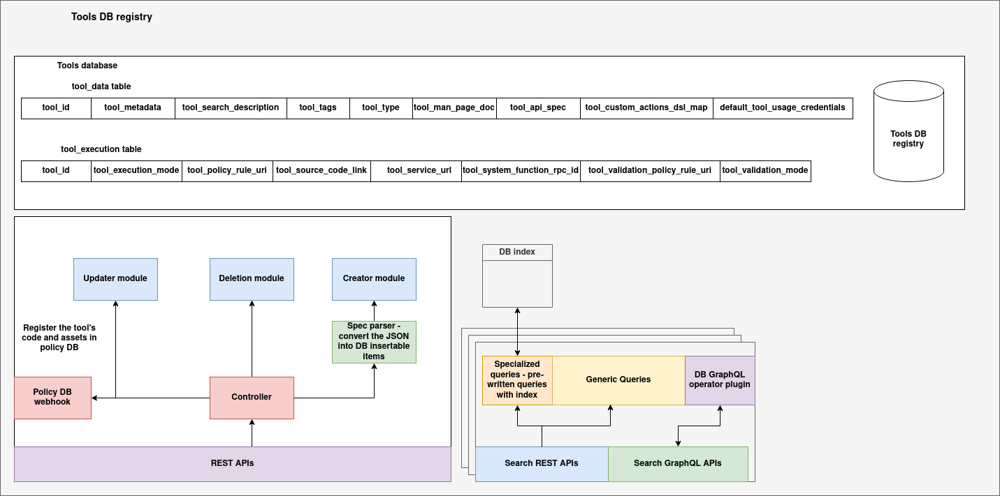

# Tools registry

## Introduction

The **Tools Registry** is a persistent, MongoDB-backed service that maintains authoritative metadata for all tools available in the system. This includes technical specifications, API contracts, DSL capabilities, runtime configurations, access credentials, and documentation.

It is the central registry from which tools are discovered, validated, and registered into agent-specific environments. The registry is used by internal services (e.g., DSL execution engines, validation services, local runtime agents) to fetch and interpret tooling metadata.

This service supports:

* Uploading new tool bundles (spec + archive + documentation)
* Querying tools by type, tags, execution mode, and other metadata
* Updating and deleting registered tools
* Full-text and DSL-powered search capabilities
* GraphQL interface for composable queries

The Tools Registry provides a single source of truth for tool definitions and facilitates downstream execution, validation, and runtime mapping workflows.

---

## Tools DB Registry Architecture

The **Tools DB Registry** is the canonical backend system for storing, indexing, and managing tool definitions, metadata, and execution configurations. It provides a unified view of tools across the organization and enables dynamic registration, discovery, and querying through well-structured APIs. The system is designed with modular CRUD pipelines, metadata transformation, indexing layers, and both REST and GraphQL-based access patterns.



### Data Model and Storage Layer

At the foundation of the Tools DB Registry is a structured database composed of two logical tables:

* **`tool_data` table**: This table holds the descriptive metadata for each tool, including fields such as `tool_id`, `tool_metadata`, `tool_tags`, `tool_api_spec`, and user-oriented documentation like `tool_search_description` and `tool_man_page_doc`. This layer represents the public-facing and indexable characteristics of each tool, making it suitable for filtering, UI rendering, and DSL search operations.

* **`tool_execution` table**: This table captures the execution-specific attributes of tools. It includes fields like `tool_execution_mode`, `tool_source_code_link`, `tool_policy_rule_uri`, and `tool_system_function_rpc_id`. These properties guide how and where the tool will be executed (e.g., locally, remotely, or via system integration). This separation of execution semantics from general metadata allows tools to evolve operationally without altering their core definitions.

---

### Tool Registration Pipeline

The Tools DB Registry uses a modular CRUD architecture to handle the lifecycle of tool entries:

* **Creator Module**: Handles new tool registrations. It accepts structured specs (usually via ZIP uploads or API calls) and invokes the **Spec Parser**, which transforms the incoming JSON into normalized records conforming to the database schema. The creator module validates schema correctness and performs insertion into both `tool_data` and `tool_execution` tables.

* **Updater Module**: Used for modifying existing tool entries. It allows partial updates while maintaining version compatibility and policy compliance. The updater also triggers re-registration workflows in the Policy DB if execution contracts have changed.

* **Deletion Module**: Handles safe deletion of tool entries. It ensures that the removal of a tool is allowed (based on usage and policy constraints), and coordinates cleanup of related execution bindings and cache entries.

* **Controller**: Acts as the gateway and coordinator for all lifecycle operations. It interfaces with all CRUD modules and interacts with external systems such as the **Policy DB Webhook** for permission checks and tool-code registration events.

---

### Policy Integration

The **Policy DB Webhook** is a critical component of the registry architecture. Whenever a tool is created or updated, its runtime configuration, source code location, and access credentials are registered in the policy layer via this webhook. This ensures that tools are only executable under the policies defined by the organization, and that policy enforcement is synchronized with database state.

---

### Search and Indexing Layer

To enable fast and flexible tool discovery, the registry incorporates a dual-mode querying infrastructure:

* **DB Index and Query Planner**: The backend maintains indexes on frequently used fields such as `tool_type`, `tool_tags`, and `tool_execution_mode`. This powers both generic and specialized query pipelines. Pre-written queries are used for common filters and are optimized with index-level acceleration.

* **Search REST APIs**: Clients can access generic or filtered search functionality via dedicated REST endpoints. These APIs support query-by-tag, type, execution mode, keyword, and more.

* **Search GraphQL APIs**: A GraphQL layer exposes the full flexibility of the query engine, allowing composable filtering logic and access to arbitrary fields. It integrates with the internal indexing system through the **DB GraphQL Operator Plugin**, which translates GraphQL queries into optimized backend lookups.

---

## Schema

The core data model used in the Tools Registry is represented by the `ToolEntry` dataclass. This structure encapsulates all necessary metadata to describe, validate, and execute a tool.

### `ToolEntry` Dataclass

```python
from dataclasses import dataclass, field
from typing import Dict, Any, List

@dataclass
class ToolEntry:
    tool_id: str = ''
    tool_metadata: Dict[str, Any] = field(default_factory=dict)
    tool_search_description: str = ''
    tool_tags: List[str] = field(default_factory=list)
    tool_type: str = ''
    tool_man_page_doc: str = ''
    tool_api_spec: Dict[str, Any] = field(default_factory=dict)
    tool_custom_actions_dsl_map: Dict[str, Any] = field(default_factory=dict)
    default_tool_usage_credentials: Dict[str, Any] = field(default_factory=dict)

    tool_execution_mode: str = ''
    tool_policy_rule_uri: str = ''
    tool_source_code_link: str = ''
    tool_service_url: str = ''
    tool_system_function_rpc_id: str = ''
    tool_validation_policy_rule_uri: str = ''
    tool_validation_mode: str = ''
```

---

### Field-wise Description

| Field Name                        | Type             | Description                                                                    |
| --------------------------------- | ---------------- | ------------------------------------------------------------------------------ |
| `tool_id`                         | `str`            | Unique identifier for the tool. Used as primary key.                           |
| `tool_metadata`                   | `Dict[str, Any]` | Arbitrary structured metadata (e.g., capabilities, version, authors).          |
| `tool_search_description`         | `str`            | Human-readable summary used for keyword-based search.                          |
| `tool_tags`                       | `List[str]`      | List of domain-specific tags to categorize the tool.                           |
| `tool_type`                       | `str`            | Logical type/category of the tool (e.g., `extractor`, `inference`, `monitor`). |
| `tool_man_page_doc`               | `str`            | Markdown-formatted documentation or user guide.                                |
| `tool_api_spec`                   | `Dict[str, Any]` | Specification of expected input/output schema for the tool.                    |
| `tool_custom_actions_dsl_map`     | `Dict[str, Any]` | Optional map of custom DSLs that define actions the tool can perform.          |
| `default_tool_usage_credentials`  | `Dict[str, Any]` | Access credentials or API tokens required to invoke the tool.                  |
| `tool_execution_mode`             | `str`            | Execution mode of the tool (e.g., `sync`, `async`, `batch`).                   |
| `tool_policy_rule_uri`            | `str`            | URI to a policy rule that governs usage.                                       |
| `tool_source_code_link`           | `str`            | Public URL to the ZIP bundle or source package of the tool.                    |
| `tool_service_url`                | `str`            | URL to the hosted microservice for this tool, if applicable.                   |
| `tool_system_function_rpc_id`     | `str`            | Internal identifier for function mapping in system runtime.                    |
| `tool_validation_policy_rule_uri` | `str`            | URI to a policy rule that governs validation behavior.                         |
| `tool_validation_mode`            | `str`            | Validation mode (e.g., `strict`, `loose`, `manual`).                           |

---

## CRUD APIs

These endpoints allow the creation, retrieval, updating, and deletion of tool entries in the Tools Registry.

### `POST /tools/upload`

**Description**: Upload a ZIP bundle containing:

* `spec.json` (metadata)
* `tool.zip` (code or binary)
* `tool.md` (markdown documentation)

The backend:

* Extracts and validates `spec.json`
* Uploads `tool.zip` to S3/Ceph
* Injects the public download URL into the spec
* Adds the content of `tool.md` as `tool_man_page_doc`
* Registers the complete tool in the MongoDB registry

**Request**:

* `multipart/form-data`

  * `file`: ZIP archive

**Response**:

```json
{
  "message": "Tool uploaded successfully",
  "tool_id": "tool-123"
}
```

**Status Codes**:

* `200 OK`: Success
* `400 Bad Request`: Missing or invalid file
* `500 Internal Server Error`: Extraction or registration failed

---

### `GET /tools/<tool_id>`

**Description**: Retrieve a registered tool by its unique `tool_id`.

**Response**:

```json
{
  "tool_id": "tool-123",
  "tool_type": "extractor",
  "tool_metadata": {...},
  ...
}
```

**Status Codes**:

* `200 OK`: Tool found
* `404 Not Found`: Tool ID does not exist

---

### `PUT /tools/<tool_id>`

**Description**: Update one or more fields in a tool entry.

**Request Body**:

```json
{
  "tool_type": "transformer",
  "tool_tags": ["ai", "image"]
}
```

**Response**:

```json
{ "message": "Tool updated successfully" }
```

**Status Codes**:

* `200 OK`: Update successful
* `400 Bad Request`: Invalid payload
* `404 Not Found`: Tool not found

---

### `DELETE /tools/<tool_id>`

**Description**: Permanently remove a tool from the registry.

**Response**:

```json
{ "message": "Tool deleted successfully" }
```

**Status Codes**:

* `200 OK`: Deletion successful
* `404 Not Found`: Tool not found

---

## Query APIs

These APIs allow clients to search and filter tools based on tags, types, metadata, keywords, and execution modes. They are optimized for typical lookup and filtering use cases.

---

### `GET /tools/query/by-type`

**Description**: Retrieve all tools that match a given tool type.

**Query Parameters**:

* `type`: Tool type (e.g., `extractor`, `validator`)

**Example**:

```
GET /tools/query/by-type?type=extractor
```

**Response**:

```json
[
  {
    "tool_id": "tool-001",
    "tool_type": "extractor",
    ...
  },
  ...
]
```

---

### `GET /tools/query/by-tag`

**Description**: Retrieve all tools that contain a specific tag.

**Query Parameters**:

* `tag`: Tag string (e.g., `image`, `nlp`)

**Example**:

```
GET /tools/query/by-tag?tag=nlp
```

**Response**:

```json
[
  {
    "tool_id": "tool-002",
    "tool_tags": ["nlp", "transformer"],
    ...
  },
  ...
]
```

---

### `GET /tools/query/by-keyword`

**Description**: Perform a text search on the `tool_search_description` field.

**Query Parameters**:

* `keyword`: Search phrase (e.g., `large language model`)

**Example**:

```
GET /tools/query/by-keyword?keyword=model
```

**Response**:

```json
[
  {
    "tool_id": "tool-003",
    "tool_search_description": "This is a large language model tool.",
    ...
  },
  ...
]
```

---

### `GET /tools/query/by-execution-mode`

**Description**: Filter tools based on their `tool_execution_mode`.

**Query Parameters**:

* `mode`: Mode string (e.g., `sync`, `async`, `batch`)

**Example**:

```
GET /tools/query/by-execution-mode?mode=batch
```

**Response**:

```json
[
  {
    "tool_id": "tool-004",
    "tool_execution_mode": "batch",
    ...
  },
  ...
]
```

---

### `GET /tools/query/by-policy-uri`

**Description**: Fetch tools by associated `tool_policy_rule_uri`.

**Query Parameters**:

* `uri`: URI string (e.g., `policies://validate/compliance/v1`)

**Example**:

```
GET /tools/query/by-policy-uri?uri=policies://validate/compliance
```

**Response**:

```json
[
  {
    "tool_id": "tool-005",
    "tool_policy_rule_uri": "policies://validate/compliance",
    ...
  },
  ...
]
```

---

### `POST /tools/query/generic`

**Description**: Execute a raw MongoDB-style query.

**Request Body**:

```json
{
  "tool_type": "extractor",
  "tool_tags": "nlp"
}
```

**Response**:

```json
[
  {
    "tool_id": "tool-001",
    ...
  },
  ...
]
```

**Status Codes**:

* `200 OK`: Query executed
* `400 Bad Request`: Invalid query structure

---

## GraphQL API

The Tools Registry provides a **GraphQL-based query interface** for flexible and composable tool discovery using arbitrary filters.

The GraphQL endpoint is served at:

```
POST /graphql
```

A built-in GraphiQL interface is also available for interactive exploration when accessed via browser.

---

### ✅ Query Interface

#### `tools(query: JSON)`

Returns a list of tools matching the provided MongoDB-style query.

**Arguments**:

* `query`: A JSON object representing a MongoDB filter

**Returns**:

* List of tool entries matching the query, each with full metadata

---

### ✅ Example Query

```graphql
query {
  tools(query: { tool_type: "extractor", tool_tags: "nlp" }) {
    tool_id
    tool_type
    tool_tags
    tool_search_description
    tool_metadata
    tool_source_code_link
  }
}
```

---

### ✅ Sample Response

```json
{
  "data": {
    "tools": [
      {
        "tool_id": "tool-nlp-01",
        "tool_type": "extractor",
        "tool_tags": ["nlp", "text"],
        "tool_search_description": "A tool for extracting named entities.",
        "tool_metadata": {
          "language": "en",
          "version": "v1.0"
        },
        "tool_source_code_link": "http://ceph.local:9000/tools-assets/tool-nlp-01/tool.zip"
      }
    ]
  }
}
```

---

### ✅ Supported Fields in GraphQL Output

All fields from the `ToolEntry` schema are supported in the query result, including:

* `tool_id`
* `tool_type`
* `tool_tags`
* `tool_metadata`
* `tool_api_spec`
* `tool_execution_mode`
* `tool_search_description`
* `tool_source_code_link`
* `tool_service_url`
* `tool_policy_rule_uri`
* `tool_validation_policy_rule_uri`
* etc.

---

