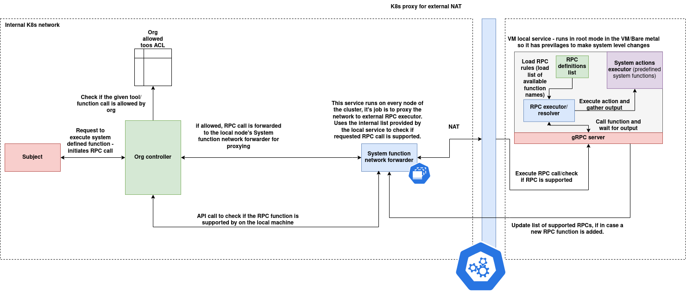

# System Tools

## Introduction

The `tools_rpc_sdk` is a modular Python SDK and runtime framework for registering, exposing, and executing distributed tools across a Kubernetes cluster using gRPC. It is designed to simplify the lifecycle of tool registration, remote invocation, node-aware execution, and cluster-wide resolution for decentralized tool orchestration.

This system enables each node in a cluster to define and expose its own local tools, which can then be discovered and triggered remotely through standardized APIs and a unified execution model. It is particularly well-suited for AI workloads, distributed agents, policy engines, or automation systems requiring localized execution with centralized coordination.

### Key Features

* **Dynamic Tool Registration**: Register tools using a simple `@register_tool` decorator.
* **gRPC Server Execution Layer**: Expose registered tools via a generic gRPC interface.
* **Cluster-Wide Resolution**: Tools are resolved using Kubernetes node labels and cached IP resolution.
* **Auto-Sync to Tool Registry**: On startup, tools can be auto-registered to a central registry via HTTP APIs.
* **gRPC Client Abstraction**: Easily execute tools remotely using a unified client interface.
* **REST API Support**: Trigger tool execution and resolution through HTTP for orchestration.
* **Extensible Design**: Plug in custom tools, orchestrators, or backends using a clean architecture.

---

## Architecture

The Org Tools Executor Server is part of a distributed, policy-controlled tool execution framework designed to securely invoke system-level functions across nodes in a Kubernetes or hybrid environment. It integrates access control, network-level forwarding, and localized RPC execution capabilities under a unified orchestration layer.

The architecture consists of three cooperating layers:



#### 1. **Subject Layer**

* This represents the initiating entity (a user, service, or agent).
* A subject submits a request to invoke a system-defined tool or function.
* This request is made to the Org Controller.

---

#### 2. **Org Controller Layer**

* The Org Controller acts as the gatekeeper and policy enforcer.
* It validates whether the requested tool/function is permitted via the Org Allowed Tools ACL.
* If allowed:

  * It identifies the correct node where the function resides.
  * It forwards the request to that node’s **System Function Network Forwarder**.
  * It can also pre-check tool availability using the `/resolve` API.
* This component is environment-aware and runs within the internal Kubernetes control plane.

---

#### 3. **Node-Level System Function Execution Layer**

Each node in the cluster hosts two key components:

**A. System Function Network Forwarder**

* A lightweight, always-running internal proxy that receives forwarded RPC calls.
* Responsible for validating whether the tool is available locally using the node's local tool registry.
* Forwards valid requests to the RPC Executor for execution.
* Ensures NAT-safe communication across internal/external boundaries if required.

**B. gRPC Tool Runtime (VM Local Service)**

* Runs in privileged mode (e.g., root context) for accessing system-level functions.
* Exposes a gRPC interface for tool invocation.
* Maintains an internal registry:

  * RPC rules (available function list)
  * RPC definitions (input/output specs)
* Executes the action and returns the structured output back up the call chain.
* Can be updated to support new RPCs dynamically via a rule/config refresh.

---

#### Tool Execution Flow

1. A **Subject** sends a tool execution request to the **Org Controller**.
2. The **Org Controller** checks if the tool is permitted for the organization.
3. If allowed, it resolves the tool’s node and forwards the call to the node’s **System Function Network Forwarder**.
4. The **Forwarder** checks if the tool exists locally and forwards the request to the **gRPC Server**.
5. The **RPC Executor** runs the tool, collects the output, and responds through the same path.

---

## Tool Schema

Each tool in the `tools_rpc_sdk` system is defined using a structured schema that encapsulates both execution logic and descriptive metadata. This schema is consistently used across the SDK, REST APIs, MongoDB persistence, and gRPC interaction layers.

### Tool Structure

Internally, tools are represented using the `ClusterLocalTools` data class. This includes information about the tool's identity, execution function, the node it belongs to, and optional metadata for documentation or orchestration.

### Data Class Definition

```python
@dataclass
class ClusterLocalTools:
    name: str
    func: Callable[[bytes], bytes]
    node_id: str
    input_spec: Dict[str, Any] = field(default_factory=dict)
    metadata: Dict[str, Any] = field(default_factory=dict)
    description: str = ""
```

### Field Descriptions

| Field         | Type                       | Description                                                         |
| ------------- | -------------------------- | ------------------------------------------------------------------- |
| `name`        | `str`                      | A unique name that identifies the tool                              |
| `func`        | `Callable[[bytes], bytes]` | The actual function implementing the tool logic                     |
| `node_id`     | `str`                      | The ID of the node where the tool is registered                     |
| `input_spec`  | `Dict[str, Any]`           | Optional input schema specification for describing the tool's input |
| `metadata`    | `Dict[str, Any]`           | Optional metadata including version, tags, authorship, etc.         |
| `description` | `str`                      | A human-readable explanation of what the tool does                  |

### Example JSON Representation

This is how the tool schema might appear when serialized for APIs or storage:

```json
{
  "name": "reverse",
  "node_id": "node-abc123",
  "input_spec": {
    "text": "string"
  },
  "metadata": {
    "version": "1.0.0",
    "author": "team-a"
  },
  "description": "Reverses a given string input"
}
```

Note: The `func` field is not serialized or transmitted over the network. It is only retained in memory for local execution.

### Input and Output Format

* The input to a tool is expected to be in `bytes` format. The tool is responsible for parsing or deserializing it (e.g., JSON, protobuf).
* The output must also be `bytes`, which the caller may decode or process according to the tool’s contract.

---

## SDK Usage

This section explains how to use the `tools_rpc_sdk` to define, register, and expose tools within your application. It includes installation instructions, tool definition workflow, and running the gRPC server using Docker.

---

### 1. Installation

Install the SDK from source using `setup.py`:

```bash
git clone https://github.com/your-org/tools_rpc_sdk.git
cd tools_rpc_sdk
pip install -e .
```

> Ensure Python 3.8 or higher is used, and `grpcio`, `kubernetes`, and `pymongo` dependencies are satisfied automatically.

---

### 2. Creating Tools

Define tools using the `@register_tool` decorator. Each tool must accept a single `bytes` input and return `bytes` output.

```python
# tools/my_tools.py

from sdk.register import register_tool

@register_tool(
    name="reverse",
    input_spec={"text": "string"},
    description="Reverses the input string",
    metadata={"version": "1.0.0", "node_id": "node-abc123"}
)
def reverse_tool(input_bytes: bytes) -> bytes:
    data = input_bytes.decode()
    reversed_data = data[::-1]
    return reversed_data.encode()
```

---

### 3. Registering and Running the Server

To expose tools via gRPC, import your tool definitions and launch the gRPC server:

```python
# run_server.py

from tools import my_tools  # triggers tool registration
from grpc.server import serve

if __name__ == "__main__":
    serve(port=50051)
```

When the server starts, the SDK will:

* Automatically register tools to the central registry using the URL from `ORG_SYSTEM_TOOLS_REGISTRY_URL`
* Delete existing entries for each tool before inserting updated definitions

Make sure to set the environment variable:

```bash
export ORG_SYSTEM_TOOLS_REGISTRY_URL=http://<registry-service>:8080
```

---

### 4. Running via Docker

You can containerize and run the tool server with Docker. Here's a basic `Dockerfile`:

```Dockerfile
FROM python:3.10-slim

WORKDIR /app

COPY . .

RUN pip install --upgrade pip && \
    pip install -e .

ENV ORG_SYSTEM_TOOLS_REGISTRY_URL=http://tools-registry-service:8080

CMD ["python", "run_server.py"]
```

Build and run the container:

```bash
docker build -t tools-runtime .
docker run --net=host -e ORG_SYSTEM_TOOLS_REGISTRY_URL=http://tools-registry-service:8080 tools-runtime
```

This container:

* Loads all tools
* Starts the gRPC server on `:50051`
* Registers tools with the central registry at startup

---

## gRPC Interface

The `tools_rpc_sdk` provides a standardized gRPC service for invoking registered tools remotely. Each node runs a gRPC server that listens for tool execution requests, resolves the tool by name, executes it, and returns the result.

This interface allows decoupled clients, controllers, or orchestrators to invoke tools deployed on any node in the cluster using a simple protocol.

---

### Service Definition

The gRPC service is defined with a single RPC method:

```proto
service ToolExecutor {
  rpc CallFunction (CallFunctionRequest) returns (CallFunctionResponse);
}
```

---

### Messages

#### `CallFunctionRequest`

| Field       | Type     | Description                                            |
| ----------- | -------- | ------------------------------------------------------ |
| `tool_name` | `string` | Name of the tool to invoke                             |
| `input`     | `bytes`  | Raw input payload; user-defined structure (e.g., JSON) |

#### `CallFunctionResponse`

| Field      | Type                  | Description                                                     |
| ---------- | --------------------- | --------------------------------------------------------------- |
| `success`  | `bool`                | Whether the tool executed successfully                          |
| `output`   | `bytes`               | Raw output from the tool; often JSON-encoded                    |
| `error`    | `string`              | Error message if the execution failed                           |
| `metadata` | `map<string, string>` | Optional execution metadata (e.g., runtime info, version, tags) |

---

### Full `.proto` File

Save this as `proto/rpc_service.proto`:

```proto
syntax = "proto3";

package toolrpc;

service ToolExecutor {
  rpc CallFunction (CallFunctionRequest) returns (CallFunctionResponse);
}

message CallFunctionRequest {
  string tool_name = 1;
  bytes input = 2;
}

message CallFunctionResponse {
  bool success = 1;
  bytes output = 2;
  string error = 3;
  map<string, string> metadata = 4;
}
```

---

## gRPC Client Example

This example assumes:

* The gRPC server is running and exposing tools
* You’ve generated the required gRPC Python bindings from `rpc_service.proto`
* You have network access to the target tool node (e.g., `localhost:50051` or `<node-ip>:50051`)

---

### Client Code: `grpc_client_example.py`

```python
import grpc
import json
from grpc import rpc_service_pb2, rpc_service_pb2_grpc

def call_tool(tool_name: str, input_data: dict, host: str = "localhost", port: int = 50051):
    channel = grpc.insecure_channel(f"{host}:{port}")
    stub = rpc_service_pb2_grpc.ToolExecutorStub(channel)

    # Serialize input as JSON bytes
    input_bytes = json.dumps(input_data).encode("utf-8")

    # Create the request message
    request = rpc_service_pb2.CallFunctionRequest(
        tool_name=tool_name,
        input=input_bytes
    )

    try:
        # Send the gRPC request
        response = stub.CallFunction(request)

        # Deserialize output (assumed to be JSON)
        output = None
        try:
            output = json.loads(response.output.decode("utf-8"))
        except Exception:
            output = response.output.decode("utf-8")

        return {
            "success": response.success,
            "output": output,
            "error": response.error,
            "metadata": dict(response.metadata)
        }

    except grpc.RpcError as e:
        return {
            "success": False,
            "output": None,
            "error": f"RPC failed: {e}",
            "metadata": {}
        }


if __name__ == "__main__":
    result = call_tool(
        tool_name="reverse_text",
        input_data={"text": "hello world"},
        host="localhost",
        port=50051
    )

    print("Response:")
    print(json.dumps(result, indent=2))
```

---

### Expected Output (Example)

```json
{
  "success": true,
  "output": {
    "result": "dlrow olleh"
  },
  "error": "",
  "metadata": {
    "version": "1.0.0",
    "node_id": "node-001"
  }
}
```

---

## Org system tools server

### Introduction

The **Org Tools Executor Server** is a centralized execution gateway designed to orchestrate the invocation of distributed tools deployed across a Kubernetes cluster. It serves as the entry point for both human and programmatic clients to resolve, locate, and execute tools dynamically, regardless of which node the tool is registered on.

This server bridges the gap between declarative tool metadata (stored in MongoDB), dynamic Kubernetes node resolution, and low-latency gRPC-based execution. It exposes a simplified REST API layer that handles input validation, tool discovery, node endpoint resolution, and gRPC dispatch — abstracting the complexity of distributed coordination from downstream consumers.

The Org Tools Executor Server is typically deployed as a stateless service inside a control namespace and works in conjunction with:

* Node-local gRPC tool servers
* A central MongoDB-based tools registry
* Kubernetes node labels for dynamic discovery

---

#### Core Capabilities

* **Tool Dispatch**: Receives a tool name and input payload, then routes the request to the correct node.
* **Dynamic Resolution**: Maps tool names to `node_id` and node IPs using metadata and Kubernetes APIs.
* **Cluster Abstraction**: Allows tool consumers to interact with a single REST endpoint regardless of where tools reside.
* **Execution Caching**: Uses in-memory caching to avoid repeated Kubernetes lookups for node information.
* **Integration-Ready**: Can be used as a backend service for CLI tools, workflows, agent runners, or dashboards.

---

#### When to Use

* To invoke tools remotely without knowing the internal node layout
* To centralize orchestration logic for multiple node-local tool runtimes
* To integrate with cluster-wide scheduling, policy enforcement, or resource allocation logic

---

### Schema

The Org Tools Executor Server operates on a consistent schema that defines the metadata and execution contract of each tool. This schema is used both in the MongoDB-backed registry and in API-level interactions to resolve and manage tool execution across the cluster.

Each tool is stored as an entry in the `cluster_local_tools` collection, modeled by the `ClusterLocalTools` data class. This schema encapsulates the identity, location, interface, and metadata of each registered tool.

---

#### Data Class: `ClusterLocalTools`

```python
@dataclass
class ClusterLocalTools:
    name: str
    func: Callable[[bytes], bytes]
    node_id: str
    input_spec: Dict[str, Any] = field(default_factory=dict)
    metadata: Dict[str, Any] = field(default_factory=dict)
    description: str = ""
```

---

#### Field Descriptions

| Field         | Type                       | Description                                                               |
| ------------- | -------------------------- | ------------------------------------------------------------------------- |
| `name`        | `str`                      | Unique identifier for the tool within the cluster                         |
| `func`        | `Callable[[bytes], bytes]` | The tool's execution function (not stored in DB; used at runtime only)    |
| `node_id`     | `str`                      | The ID of the Kubernetes node where the tool is registered                |
| `input_spec`  | `Dict[str, Any]`           | Optional schema describing the structure and expected keys of the input   |
| `metadata`    | `Dict[str, Any]`           | Arbitrary metadata (e.g., version, tags, runtime environment, authorship) |
| `description` | `str`                      | Human-readable description of the tool's purpose                          |

---

#### Example MongoDB Document

```json
{
  "name": "reverse_text",
  "node_id": "node-abc123",
  "input_spec": {
    "text": "string"
  },
  "metadata": {
    "version": "1.0.0",
    "team": "tools-core",
    "language": "python"
  },
  "description": "Reverses a given string input"
}
```

> Note: The `func` field is only used at runtime on the node-local tool server. It is not stored in MongoDB or transmitted over the network.

---

#### Schema Constraints

* The combination of `name` and `node_id` must be unique.
* Tools must be registered via HTTP or programmatic SDK calls before they can be resolved or executed.
* All input and output are handled in raw `bytes`; serialization and deserialization are handled by the tool itself.

---

### REST APIs

The Org Tools Executor Server provides a minimal and standardized REST API for resolving and executing distributed tools registered across a Kubernetes cluster. These APIs abstract away node-specific logic and provide a centralized interface for invoking tool functionality.

All endpoints use JSON for both input and output and are served over HTTP (default port: `8080`).

---

#### 1. **POST /cluster-tools/execute**

Executes a distributed tool by name. The server internally resolves the tool’s node, locates the corresponding gRPC server, and dispatches the request.

##### Request Body

```json
{
  "tool_name": "reverse_text",
  "input": {
    "text": "hello world"
  }
}
```

> The input payload is serialized to bytes and passed directly to the tool. It is the tool’s responsibility to parse and validate the input.

##### Response Body (Success)

```json
{
  "success": true,
  "output": {
    "result": "dlrow olleh"
  },
  "error": "",
  "metadata": {
    "version": "1.0.0",
    "node_id": "node-abc123"
  }
}
```

##### Response Body (Failure)

```json
{
  "success": false,
  "output": null,
  "error": "Tool 'reverse_text' not found on any node",
  "metadata": {}
}
```

---

#### 2. **POST /cluster-tools/resolve**

Resolves a tool’s registered node and returns the public gRPC endpoint used for remote invocation.

##### Request Body

```json
{
  "tool_name": "reverse_text"
}
```

##### Response Body (Success)

```json
{
  "success": true,
  "endpoint": "10.42.0.12:50051"
}
```

##### Response Body (Failure)

```json
{
  "success": false,
  "error": "Tool 'reverse_text' not found in database"
}
```

---

### Summary of Routes

| Method | Path                     | Description                                    |
| ------ | ------------------------ | ---------------------------------------------- |
| POST   | `/cluster-tools/execute` | Executes a named tool with user-provided input |
| POST   | `/cluster-tools/resolve` | Resolves a tool name to a gRPC host\:port URL  |

---

### Tool Resolution Logic

The tool resolution mechanism is the core of the Org Tools Executor Server. It is responsible for identifying where a tool is located within the Kubernetes cluster, resolving the IP address of the associated node, and returning a usable gRPC endpoint for remote execution.

This logic is implemented in the `Resolver` class and used by both the `/cluster-tools/execute` and `/cluster-tools/resolve` APIs.

---

#### Resolution Workflow

The resolution process follows these steps:

1. **Tool Lookup in MongoDB**

   * The server queries the `cluster_local_tools` collection in MongoDB to find the tool by its unique `tool_name`.
   * If multiple entries exist (e.g., deployed on multiple nodes), the first match is used (can be extended for selection policies).

2. **Extract `node_id`**

   * From the retrieved document, the server extracts the `node_id` — the ID of the Kubernetes node where the tool was registered.

3. **Kubernetes Node Query**

   * The server uses the Kubernetes Python client (via in-cluster configuration) to fetch the list of all nodes.
   * It searches for a node where the label `nodeID` matches the `node_id` of the tool.

4. **Resolve Internal IP**

   * Once the correct node is found, the `InternalIP` from the node status is extracted.
   * This is the IP address used to reach the node-local gRPC tool server.

5. **Assemble Endpoint**

   * The IP address is combined with the fixed gRPC port (default: `50051`) to create a gRPC endpoint in the form:
     `"<internal-ip>:50051"`

6. **Cache for Reuse**

   * The mapping `{ node_id → IP }` is cached in memory to avoid repeated Kubernetes API calls for the same node.

---

#### Example

Given a tool registration:

```json
{
  "name": "reverse_text",
  "node_id": "node-abc123",
  "metadata": {
    "version": "1.0.0"
  }
}
```

The system will:

* Query Kubernetes for a node with label `nodeID=node-abc123`
* Extract its `InternalIP` (e.g., `10.42.0.12`)
* Return `10.42.0.12:50051` as the tool's execution endpoint

---

#### Caching Behavior

* The `Resolver` maintains an in-memory cache:
  `{ node_id: ip_address }`
* This cache is populated on first lookup and reused across subsequent requests
* It improves performance and reduces pressure on the Kubernetes API

---

#### Failure Scenarios

| Failure Mode               | Response Code | Explanation                                            |
| -------------------------- | ------------- | ------------------------------------------------------ |
| Tool not found in DB       | 404           | Tool was never registered or misspelled                |
| Node label not found       | 404           | Tool references a `node_id` that doesn't map to a node |
| Node has no InternalIP     | 500           | Misconfigured Kubernetes node                          |
| Kubernetes API unavailable | 500           | In-cluster client is not set up properly               |

---
