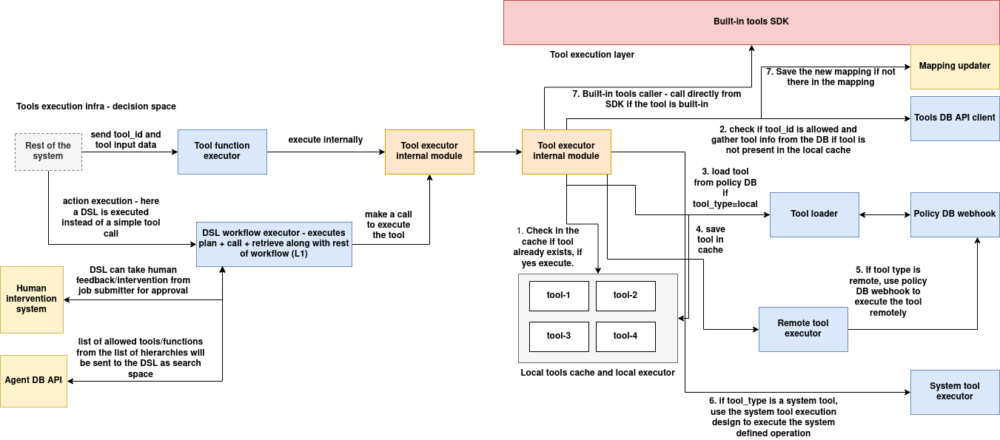

## Introduction

The **Tools Registry SDK** is a unified Python client that interacts with the MongoDB-backed Tools Registry service and supports both **tool discovery** and **tool execution**.

It serves as the official integration layer for internal agents, execution environments, and DSL pipelines that need to:

* Discover tools by ID, tags, type, or metadata
* Fetch full tool specifications including API contracts and execution configuration
* Execute tools locally or via binary wrappers, using validated input
* Automatically download and register tools before execution
* Validate inputs against tool-defined API specs

The SDK seamlessly integrates with `ToolsLocalExecutor` and dynamically selects between Python or binary execution modes based on `tool_runtime_type`.

---

## SDK Architecture

The `tools_sdk` is designed as a modular execution framework that supports dynamic discovery, validation, and execution of tools within a policy-governed, agent-scoped infrastructure. It bridges multiple layers—including decision logic, runtime execution, DSL evaluation, and system-level delegation—to securely and efficiently manage tooling operations in distributed environments.



### Tool Invocation and Decision Layer

The tool execution process begins when a subject—such as a user, agent, or automation system—initiates a tool call by providing a `tool_id` and its input payload. This request enters the **Tool Function Executor**, which determines whether the call corresponds to a direct tool execution or a higher-level action defined as a DSL workflow. If the request refers to an action, the **DSL Workflow Executor** is invoked to evaluate and select the appropriate tool using a defined DSL plan. This DSL engine supports filtering based on input metadata, invoking external APIs, and even awaiting manual feedback through a **Human Intervention System**. The allowed tool/action list used in DSL evaluation is scoped and provided via the **Agent DB API**, ensuring organization-specific execution context.

---

### Tool Executor Layer

After a tool is selected—either directly or via DSL—the control passes to the **Tool Executor Internal Module**, which is responsible for resolving and dispatching the tool for execution. Its first task is to consult the **Local Tools Cache** to check whether the tool has already been loaded. If so, execution proceeds immediately using the pre-initialized runtime environment, avoiding redundant loading.

If the tool is not present in the cache, the executor invokes the **Tool Loader**, which communicates with the **Tools DB API Client** to retrieve the full metadata, including API specifications, runtime type, and execution contracts. Before continuing, the loader queries the **Policy DB Webhook** to validate that the requesting subject has permission to use the tool. If validation passes, the tool is loaded, initialized, and stored in the local cache.

---

### Execution Mode Resolution

Once a tool is loaded, the executor determines how it should be run based on its `tool_type`. If the tool is marked as `local`, it is executed directly using the appropriate internal backend—either as a Python module or binary process—based on the tool's runtime configuration.

For tools classified as `remote`, execution is delegated through the **Remote Tool Executor**, which uses the **Policy DB Webhook** to proxy the call to a remote runtime node or container. This supports isolated, multi-node tool execution across a cluster while maintaining centralized control.

System tools—those labeled with `tool_type = system`—are dispatched to the **System Tool Executor**. These tools represent privileged operations (e.g., modifying system configuration, triggering OS-level processes) and are executed in VM or bare-metal environments using gRPC-based privileged services. This path is strictly controlled by access policies and is isolated from normal tool execution to protect system integrity.

---

### Mapping and Built-in Tools Handling

The SDK includes a **Mapping Updater** module that maintains a mapping between tool IDs and their resolved execution handlers. When a tool is resolved for the first time, this mapping is persisted for fast access in subsequent calls. If the tool is marked as built-in, it is executed directly from the SDK without requiring external resolution. This enables low-latency dispatch for frequently used or system-critical tools.

---

### Core Capabilities

| Feature                     | Description                                                                     |
| --------------------------- | ------------------------------------------------------------------------------- |
| **Fetch tool metadata**     | Retrieve full `ToolEntry` from the registry by ID                               |
| **Input validation**        | Validate user input against the `tool_api_spec` field                           |
| **Local execution support** | Execute registered tools using Python or binary backends                        |
| **On-demand registration**  | Automatically download and initialize tools at runtime                          |
| **Runtime isolation**       | Abstracts underlying executor (e.g., `LocalToolExecutor`, `BinaryToolExecutor`) |

---

## Installation

The `tools_sdk` package provides programmatic access to the Tools Registry system. It includes capabilities for fetching tool metadata, managing in-memory registries, performing DSL-based searches, and executing tools in local runtime environments.

It can be installed as a standard Python module from source or deployed via an internal package registry.

---

### Prerequisites

* Python 3.7 or higher
* `pip` (Python package installer)

---

### Option 1: Local Installation from Source

If you have the source code locally (e.g., cloned from a Git repository), install the SDK using:

```bash
cd tools_sdk/
pip install .
```

This will install the package into your Python environment.

---

### Option 2: Editable Installation for Development

To install in **editable mode** (auto-reflects code changes):

```bash
cd tools_sdk/
pip install -e .
```

This is recommended during active development or integration testing.

---

### Option 3: Installation from Private Package Index

If the SDK is published on an internal PyPI-compatible index:

```bash
pip install tools_sdk --extra-index-url https://your-internal-pypi/
```

Replace `your-internal-pypi` with your actual internal registry URL.

---

### Post-Installation Verification

To confirm the SDK is installed and usable:

```bash
python -c "from tools_sdk import ToolsManager; print('ToolsManager available')"
```

You can also validate full instantiation:

```python
from tools_sdk import ToolsManager

tm = ToolsManager(
    tools_db_url="http://tools-db-service:5000",
    workflows_base_uri="http://workflow-service:6000"
)
```

---

## Basic Usage

This section demonstrates how to use the `tools_sdk` to register tools, create actions, perform DSL-based selection, and execute tools.

---

### 1. Initialize the `ToolsManager`

```python
from tools_sdk import ToolsManager

tools = ToolsManager(
    tools_db_url="http://tools-db-service:5000",
    workflows_base_uri="http://workflow-registry:6000"
)
```

---

### 2. Register a Tool from the Tools DB

```python
tools.add_tool(
    tool_id="tool-nlp-001",
    derived_from="tools-db",
    mapping_org_id="org-abc"
)
```

This fetches the tool metadata from the tools DB and stores it in the in-memory registry.

---

### 3. Create a Tool Action

```python
tools.create_action(
    action_type="nlp-action",
    tool_ids=["tool-nlp-001", "tool-nlp-002"],
    action_tags=["text", "inference"],
    action_metadata={"category": "nlp"},
    action_search_description="Performs NLP-based processing.",
    action_dsl={},  # Can be filled with a DSL if needed
    derived_from="tools-db",
    mapping_org_id="org-abc"
)
```

---

### 4. Execute a Tool Directly by ID

```python
output = tools.execute_tool_by_id(
    tool_id="tool-nlp-001",
    input_data={"text": "This is a test"}
)
print("Output:", output)
```

---

### 5. Execute a Tool Selected via DSL Search

```python
output = tools.execute_by_tool_search(
    workflow_id="nlp_tool_selector",
    input_data={"text": "Some input text"},
    search_parameters={"language": "en", "domain": "general"}
)
print("Selected Tool Output:", output)
```

---

### 6. Execute a Tool via Action + DSL-Based Tool Selection

```python
output = tools.execute_by_action_search(
    workflow_id="select_nlp_action",
    input_data={"text": "Hello world"},
    search_parameters={"domain": "text", "accuracy": "high"}
)
print("Action-Selected Tool Output:", output)
```

---

## Advanced Features

The `tools_sdk` includes a range of advanced capabilities designed for dynamic runtime environments, agent orchestration, and intelligent tool selection. These features allow deeper integration with DSLs, remote registries, and policy-governed execution environments.

---

### 1. **On-Demand Tool Registration**

When executing a tool by `tool_id`, if it is not already registered in the local runtime, the SDK automatically fetches it from the Tools DB and initializes the appropriate executor (Python or binary).

```python
output = tools.execute_tool_by_id("tool-auto-001", {"x": 10})
```

No prior registration is needed.

---

### 2. **DSL-Based Selection Logic**

The SDK supports DSL workflows to select the best-matching tool or action based on runtime `search_parameters`.

#### Example:

```python
output = tools.execute_by_tool_search(
    workflow_id="select_text_tool",
    input_data={"text": "Analyze this sentence."},
    search_parameters={"language": "en", "category": "text"}
)
```

The DSL receives both the `search_parameters` and the list of available tools, and returns the best candidate.

---

### 3. **Tool Execution Isolation**

Each tool is executed in isolation using the appropriate backend determined by the tool's `tool_runtime_type`. Supported runtimes include:

* **Python module execution**
* **Binary execution with argument passing**

This abstraction is handled via the internal `ToolsExecutionManager`.

---

### 4. **Input Validation via Tool API Spec**

Before execution, the input data is validated against the tool’s declared `tool_api_spec`.

```python
# Fails if 'x' is not a number or required field
tools.execute_tool_by_id("tool-validate-01", {"x": "invalid"})
```

---

### 5. **Action-Based Tool Selection**

Actions group tools and contain a DSL to select one tool from the set. This enables:

* Fallback logic
* Priority-based selection
* Dynamic filtering at runtime

```python
output = tools.execute_by_action_search(
    workflow_id="select_best_summarizer",
    input_data={"text": "A long paragraph..."},
    search_parameters={"quality": "high", "length": "short"}
)
```

---

### 6. **Supports Multi-Context Usage**

Each `ToolsManager` instance supports scoped, in-memory views of tools and actions per agent or organization. This design enables:

* Organizational separation
* Agent-level caching
* Memory-optimized execution

---

## Class Reference

### `class ToolsManager`

The `ToolsManager` is the primary interface provided by `tools_sdk`. It manages tool discovery, DSL-based selection, action management, and runtime tool execution. It integrates multiple internal components such as local registries, the DSL search engine, and execution manager.

#### **Constructor**

```python
ToolsManager(tools_db_url: str, workflows_base_uri: str)
```

**Parameters:**

* `tools_db_url`: Base URL of the persistent Tools Registry service (MongoDB-backed)
* `workflows_base_uri`: Base URL of the DSL Workflow Registry used for tool and action selection

---

### Methods

---

#### `add_tool(tool_id: str, derived_from: str, mapping_org_id: str) -> bool`

Fetches tool metadata from the Tools DB and registers it in the local in-memory store.

**Parameters:**

* `tool_id`: Unique identifier of the tool
* `derived_from`: Source (e.g., "tools-db", "imported")
* `mapping_org_id`: Organization or agent context

---

#### `create_action(...) -> bool`

Creates a new logical grouping of tools, represented as an action, and stores it in the action registry.

**Parameters:**

* `action_type`: Unique action identifier (also used as DSL workflow ID)
* `tool_ids`: List of `tool_id` values to associate with the action
* `action_tags`: Tags for indexing and classification
* `action_metadata`: Arbitrary key-value metadata
* `action_search_description`: Description used for querying
* `action_dsl`: DSL config that will be executed to select the best tool
* `derived_from`: Source of the action definition
* `mapping_org_id`: Org/agent scope

---

#### `search_tool(workflow_id, user_input, global_settings=None) -> Optional[AgentAllowedTool]`

Uses a DSL workflow to select the most appropriate tool from the local registry.

**Parameters:**

* `workflow_id`: DSL workflow ID used for selection
* `user_input`: Input dictionary passed to DSL
* `global_settings`: Optional DSL `addons` or runtime overrides

---

#### `search_action(workflow_id, user_input, global_settings=None) -> Optional[AgentAllowedToolAction]`

Uses a DSL to select an action based on runtime metadata.

**Parameters:**

* Same as `search_tool`

---

#### `search_tool_from_action(action_type, mapping_org_id, user_input, global_settings=None) -> Optional[AgentAllowedTool]`

Uses the DSL inside a selected action to choose a tool from its mapped tools.

**Parameters:**

* `action_type`: ID of the action
* `mapping_org_id`: Context of the action (for scoped lookup)
* `user_input`: Input to the internal DSL
* `global_settings`: Optional overrides

---

#### `execute_tool_by_id(tool_id, input_data) -> Any`

Executes a tool by ID. If not registered, it is fetched and initialized automatically. Inputs are validated against the tool's `tool_api_spec`.

**Parameters:**

* `tool_id`: Identifier of the tool
* `input_data`: Payload to pass to the executor

---

#### `execute_by_tool_search(workflow_id, input_data, search_parameters, global_settings=None) -> Any`

Performs a DSL-based search over available tools, selects the best match, and executes it.

**Parameters:**

* `workflow_id`: DSL selector for tool
* `input_data`: Data passed to the selected tool
* `search_parameters`: Input to guide the DSL selection
* `global_settings`: Optional overrides

---

#### `execute_by_action_search(workflow_id, input_data, search_parameters, global_settings=None) -> Any`

Performs a DSL-based action selection followed by internal tool selection and execution.

**Parameters:**

* Same as `execute_by_tool_search`

---

#### `search_and_execute_tool_from_action(...) -> Any`

Helper method to:

1. Run the DSL inside a given action to select the best tool.
2. Execute the selected tool.

**Parameters:**

* `action_type`, `mapping_org_id`: Context of the action
* `input_data`: Final tool execution input
* `search_parameters`: Used for tool selection via DSL
* `global_settings`: Optional overrides

---

## Supporting Classes

The `tools_sdk` architecture is modular. Each responsibility is encapsulated in a supporting class that integrates with the main `ToolsManager`.

---

### `class ToolsRegistrySDK`

**Purpose**:
Communicates with the MongoDB-backed Tools Registry service over HTTP.

**Responsibilities**:

* Fetch full tool metadata by `tool_id`
* Validate the availability of a tool before registration or execution
* Can be extended to support update and delete operations

**Key Method**:

```python
get_tool_by_id(tool_id: str) -> Dict[str, Any]
```

---

### `class ToolsLocalExecutor`

**Purpose**:
Manages registration, validation, and execution of tools in the local runtime.

**Responsibilities**:

* Automatically selects the correct execution backend:

  * `LocalToolExecutor` (for Python tools)
  * `BinaryToolExecutor` (for compiled binaries)
* Validates input against `tool_api_spec`
* Manages lifecycle of registered tool instances

**Key Methods**:

* `register(instance_name, tool_id)`
* `execute(instance_name, input_data)`
* `unregister(instance_name)`
* `get_instance_data(instance_name)`

---

### `class ToolsDSLSearch`

**Purpose**:
Provides DSL-based tool and action selection by integrating with the workflow engine.

**Responsibilities**:

* Accepts user input and list of tool/action candidates
* Delegates selection logic to a remote or local DSL executor
* Returns the best-matching tool or action

**Key Methods**:

* `select_tool_by_input(...)`
* `select_action_by_input(...)`
* `dsl_select_tool_from_action(...)`

---

### `class AgentAllowedToolStore`

**Purpose**:
In-memory registry of tools that have been made available to a specific agent or organization.

**Responsibilities**:

* Stores `AgentAllowedTool` instances keyed by `tool_id`
* Supports basic CRUD operations (add, get, update, delete)

---

### `class AgentAllowedToolActionStore`

**Purpose**:
In-memory registry of actions (grouped tools) scoped to a specific agent or organization.

**Responsibilities**:

* Stores `AgentAllowedToolAction` instances
* Keyed by `(action_type, mapping_org_id)`
* Used in DSL-based action evaluation and execution flows

---

### `class AgentAllowedTool` and `AgentAllowedToolAction`

**Purpose**:
Dataclasses that model the in-memory representations of tools and grouped tool actions.

**Used for**:

* Tool filtering, DSL processing, runtime execution context


